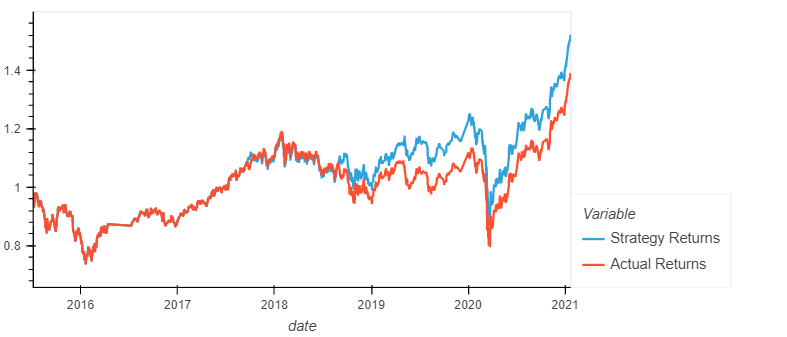
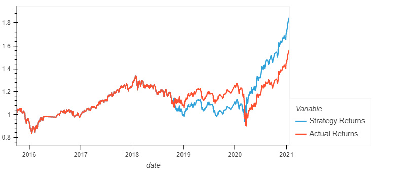
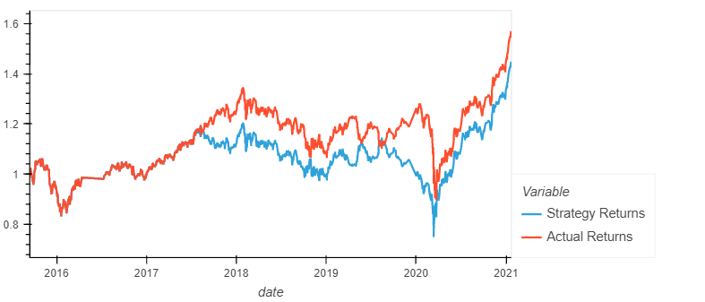
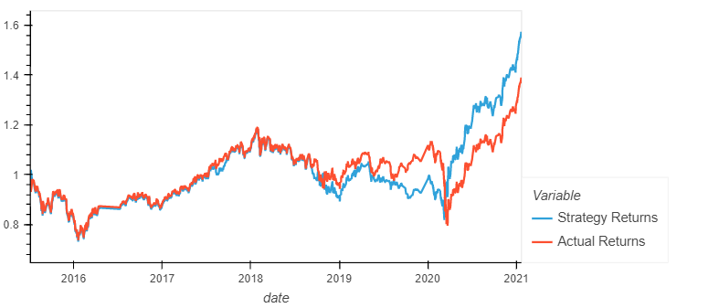

# Trading Algorithm With Machine Learning

## Summary

This notebook contains an analysis of two machine learning algorithms used to trade the Emerging Markets index fund with different parameters. This anaylsis will attempt to compare the two algorithms to determine which one is best suited for the task.

 

## Baseline Trading

To establish a baseline returns to compare the machine learning algorithms, the returns of the index fund using the Dual Moving Average Crossover strategy (DMAC) using SVC as the baseline algorithm with a 3 month offset is shown below:

 

## Longer Offset Period

If the algorithm had a longer timespan to work with, then it most likely will possibly perform better but it may also perform worse depending on the time when the algorithm was running. The following image shows the algorithm trading with a date offset of 6 months:

As compared to the baseline trading results, setting a longer offset caused it to have higher returns in the end, but with a higher drawdown then the baseline trading.

 

## Longer SMA Windows

By adjusting both SMA windows to 50 for the fast SMA and 200 for the slow SMA, the algorithm performed worse overall as compared to the baseline trading and setting a longer date offest period as seen below:

It seems that increasing the SMA windows (either fast or slow) may lead to degradation in performance for the DMAC strategy.

 

## Best Improvment?

It seems that the best improvement to make for the algorithm is to increase the date offset period for the training data so that it can have more data to work with when fitting the model.

 

## Using The AdaBoostClassifier Model

To compare the baseline SVC model, the Ada Boost Classifier model will be used. The screenshot below shows the returns of the new model used:

There a few points to note:
* This model seems to performed better than the baseline model, at the expense of increased drawdown and volatility.
* While this model had increased volatility and drawdown, it does perform better than trying to manually tune the SMA lengths or even increasing the date offset period even during periods of high drawdown.

 

# Conclusion

To conclude this report, it turns out that manually tuning the values of the trading algorithm is not ideal, as it does not allow for flexibility in different market conditions. While the Ada Boost Classifier had higher returns, the volatility and drawdown made the model not as desirable as the baseline model.